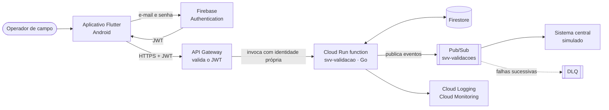

# serverless-vending-validation

Ecossistema serverless na Google Cloud Platform para validação de máquinas de venda automática
(vending machines) que operam **offline**, tendo o **Crane National 168** como caso de estudo.

Trabalho de Conclusão de Curso 2 — Engenharia de Computação, UTFPR Câmpus Apucarana.
Autor: Thiago Cristovão de Souza. Orientador: Prof. Me. Muriel de Souza Godoi.

## O problema

Máquinas como a Crane National 168 não têm conectividade. A validação em campo depende do
aplicativo do operador e de um sistema central que, quando fica indisponível, paralisa a operação.
Este projeto desacopla a validação em um serviço serverless independente e envia os registros ao
sistema central de forma assíncrona, para que a operação em campo continue mesmo com o sistema
central fora do ar.

## Arquitetura



Toda a infraestrutura é descrita em Terraform e provisionada em `us-east1`. A arquitetura completa,
com fluxos de exceção, está em [docs/arquitetura.md](docs/arquitetura.md).

## Estado do projeto

Sprints concluídas: **0** (fundação), **1** e **2** (requisitos, contrato e arquitetura),
**3** (infraestrutura base em Terraform), **4** (domínio do serviço em Go) e **5** (serviço
implantado atrás do API Gateway, com Firestore, Pub/Sub e reconciliação, verificado de ponta a
ponta em `svv-dev`). Próxima: **6** (aplicativo: autenticação e leitura do QR). O planejamento completo está em
[docs/planejamento-sprints.md](docs/planejamento-sprints.md); as decisões tomadas, em
[docs/adr](docs/adr).

## Estrutura do repositório

```
api/                       contrato OpenAPI 3.1 (canônico) e exemplos de payload
servico/                   serviço de validação em Go (Cloud Run function) — Sprint 4
aplicativo/                aplicativo Flutter do operador — Sprint 6
sistema-central-simulado/  consumidor Pub/Sub que simula o sistema central — Sprint 8
ferramentas/               scripts de apoio (gerador de QR, carga, injeção de falhas)
infra/
  bootstrap/               APIs, bucket de estado e orçamento (roda uma vez)
  modulos/                 módulos Terraform por serviço gerenciado
  ambientes/dev/           composição do ambiente de desenvolvimento
docs/
  requisitos.md            requisitos funcionais e não funcionais — Sprint 1
  payload-qr.md            esquema do QR code fixado na máquina — Sprint 1
  modelo-dados.md          coleções do Firestore e esquema dos eventos — Sprint 1
  arquitetura.md           componentes, fluxos, exceções, segurança — Sprint 2
  diagramas/               fontes Mermaid dos diagramas
  adr/                     registros de decisão de arquitetura
  operacao/                configuração do ambiente e convenções
  referencias/             proposta do TCC 1 (PDF)
```

## Pré-requisitos

- Linux ou macOS com `git`, `curl`, `make` e, opcionalmente, Docker (usado como alternativa para
  `terraform` e `redocly` quando não estão instalados).
- [mise](https://mise.jdx.dev) para Go e Terraform, [FVM](https://fvm.app) para Flutter e o
  [gcloud CLI](https://cloud.google.com/sdk/docs/install). Versões fixadas em `.mise.toml` e
  `aplicativo/.fvmrc`.
- Uma conta Google com faturamento habilitado na GCP.
- Um dispositivo Android físico com depuração USB (a leitura de QR não é verificável em emulador).

## Começando

```bash
git clone git@github.com:ThiagoCristovao/serverless-vending-validation.git
cd serverless-vending-validation
make configurar          # mise install + fvm install
gcloud auth login
gcloud auth application-default login
```

Em seguida, siga [docs/operacao/configuracao-ambiente.md](docs/operacao/configuracao-ambiente.md)
para criar o projeto GCP, vincular o faturamento e aplicar o bootstrap. Ao final,
`make verificar` deve passar e `make infra-dev-init` deve inicializar o ambiente contra o backend
remoto.

## Comandos

| Comando | O que faz |
|---|---|
| `make ajuda` | Lista todos os alvos |
| `make configurar` | Instala o toolchain fixado |
| `make verificar` | Formatação e validação do Terraform e lint do OpenAPI (o mesmo que a CI) |
| `make infra-bootstrap-apply` | Aplica o bootstrap (APIs, bucket de estado, orçamento) |
| `make infra-dev-init` / `plan` / `apply` | Opera o ambiente de desenvolvimento |
| `make api-lint` | Valida `api/openapi.yaml` |

## Convenções

Código, commits e documentação em português; identificadores sem acentos; Conventional Commits;
branches `sprint-N/descricao`. Detalhes em
[docs/operacao/convencoes.md](docs/operacao/convencoes.md).

## Licença

[GPL-3.0](LICENSE).
