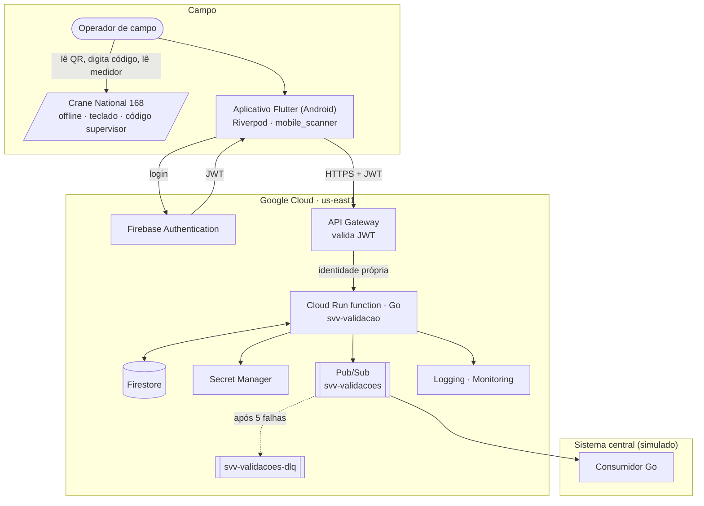

# Arquitetura

**Sprint 2 — Projeto da arquitetura.** Como os componentes se comunicam e como o sistema se
comporta diante de falhas. Critério de conclusão: cada cenário de falha previsto na avaliação
técnica (TCC 1, Seção 3.4.7) tem comportamento esperado documentado (seção 9).

Fontes dos diagramas em [diagramas/](diagramas/). Decisões em [adr/](adr/).

## 1. Visão geral e atributos de qualidade

| Atributo (objetivo geral) | Como a arquitetura o sustenta | Onde é avaliado |
|---|---|---|
| **Resiliência operacional** | Persistência antes da publicação; mensagens retidas no Pub/Sub com retentativa e DLQ; idempotência de ponta a ponta; retentativa no dispositivo | Sprint 9 |
| **Escalabilidade** | Função serverless com escala automática e concorrência por instância; Firestore e Pub/Sub gerenciados; nenhum estado em memória | Sprint 10 |
| **Independência do sistema central** | O sistema central só recebe eventos assíncronos; nenhuma chamada síncrona a ele no caminho do operador | Sprint 9 |

## 2. Componentes



| Componente | Tecnologia | Responsabilidade | Sprint |
|---|---|---|---|
| Aplicativo | Flutter 3.47 (Android), Riverpod, `mobile_scanner` | Autenticar, ler e validar o QR localmente, chamar o serviço, exibir contrassenha, capturar leituras, tratar falhas de rede | 6, 7 |
| Firebase Authentication | Identity Platform, e-mail e senha | Emitir e renovar ID tokens (JWT) | 3 |
| API Gateway | `svv-<amb>-gateway`, `us-east1`, OpenAPI 3.1 | Validar JWT, rotear para a função com identidade própria, expor `/v1` | 5 |
| Serviço de validação | Cloud Run function 2ª ger., Go 1.27, arquitetura limpa | Regras de negócio, persistência, publicação, logs | 4, 5 |
| Firestore | Modo nativo, `us-east1` | Máquinas, validações, operadores, chaves públicas | 3 |
| Secret Manager | — | Chave HMAC da contrassenha | 3 |
| Pub/Sub | Tópico + assinatura ordenada + DLQ | Entrega assíncrona e durável ao sistema central | 3 |
| Sistema central simulado | Go, pull subscriber | Consumir eventos de forma idempotente; simular indisponibilidade | 8 |
| Observabilidade | Cloud Logging, Monitoring | Logs estruturados, métricas, painel, alertas | 3, 5 |
| Terraform | 1.16, provider google 8.x | Provisionar tudo acima de forma reproduzível | 0, 3, 5 |

## 3. Fluxo principal

```mermaid
sequenceDiagram
  autonumber
  actor Op as Operador
  participant App as Aplicativo
  participant Auth as Firebase Auth
  participant GW as API Gateway
  participant Fn as Função
  participant FS as Firestore
  participant PS as Pub/Sub
  Op->>App: E-mail e senha
  App->>Auth: signIn
  Auth-->>App: JWT
  Op->>App: Lê o QR
  App->>App: Validação local
  App->>GW: POST /v1/validacoes (JWT, Idempotency-Key)
  GW->>Fn: Encaminha (X-Apigw-Api-Userinfo)
  Fn->>FS: Transação: cria validação aberta
  Fn->>Fn: Deriva contrassenha e próxima (HMAC)
  Fn->>PS: validacao.iniciada
  Fn-->>App: 201 {contrassenha, proximaContrassenha, maquina}
  Op->>Op: Digita código, lê medidor, programa próximo código
  Op->>App: Leituras + confirmação
  App->>GW: POST /v1/validacoes/{id}/conclusao
  GW->>Fn: Encaminha
  Fn->>FS: Transação: concluida; contador += 1
  Fn->>PS: validacao.concluida
  Fn-->>App: 200
```

Versão completa em [diagramas/sequencia-principal.mmd](diagramas/sequencia-principal.mmd).

## 4. Contratos

- **API:** [`api/openapi.yaml`](../api/openapi.yaml) — três operações: `iniciarValidacao`,
  `consultarValidacao`, `concluirValidacao`. Erros em Problem Details (ADR-0009).
- **QR:** [payload-qr.md](payload-qr.md) — JSON estático assinado com Ed25519.
- **Eventos:** [modelo-dados.md](modelo-dados.md), seção 6 — `validacao.iniciada` e
  `validacao.concluida`, *event-carried state transfer*, sem contrassenha no corpo.
- **Dados:** [modelo-dados.md](modelo-dados.md) — coleções, transações e índices.

## 5. Autenticação e autorização por camada

| Camada | O que verifica | Se falhar |
|---|---|---|
| Aplicativo | Credenciais via SDK do Firebase; renova o ID token antes de cada chamada | Volta ao login |
| API Gateway | Assinatura do JWT (JWKS do Firebase), `iss = https://securetoken.google.com/<PROJETO_ID>`, `aud = <PROJETO_ID>`, `exp` | `401`, a função não é invocada |
| IAM da função | O invocador é a conta de serviço do gateway (`roles/run.invoker`); nenhum acesso público | `403` do IAM |
| Adaptador HTTP | Presença e forma do cabeçalho `X-Apigw-Api-Userinfo`; extrai `uid` | `401` |
| Domínio | Operador existe e está `ativo`; em consultas, é o dono da validação | `403 operador_nao_autorizado` |

Contas de serviço e papéis: [`infra/modulos/iam/README.md`](../infra/modulos/iam/README.md).
Segredos: chave HMAC no Secret Manager, montada como variável de ambiente secreta da função; chave
privada do QR fora da nuvem; nenhuma credencial no aplicativo.

## 6. Mensageria

| Elemento | Nome | Configuração |
|---|---|---|
| Tópico principal | `svv-<amb>-validacoes` | Retenção de mensagens 7 dias |
| Assinatura do sistema central | `svv-<amb>-sistema-central` | Pull; `ack_deadline` 60 s; ordenação por `idMaquina`; retentativa exponencial 10 s → 600 s; DLQ após 5 tentativas |
| Tópico de mensagens mortas | `svv-<amb>-validacoes-dlq` | Retenção 7 dias |
| Assinatura de inspeção da DLQ | `svv-<amb>-validacoes-dlq-inspecao` | Pull; usada por testes e inspeção manual |

Semântica **at-least-once**: o consumidor é idempotente por `(idValidacao, tipo)`. A ordenação por
`idMaquina` garante que `concluida` não chegue antes de `iniciada` para a mesma máquina.

**Publicação e independência (RNF-04).** A função persiste a validação **antes** de publicar. A
publicação usa tempo limite curto (2 s) e uma retentativa; se falhar, a resposta ao operador é a
mesma e o documento fica com `eventos.*PublicadaEm = null`.

> **TODO (Sprint 5):** escolher o mecanismo de reconciliação das publicações pendentes: (a) Cloud
> Scheduler chamando um endpoint interno da função que republica documentos com marcador nulo;
> (b) segunda função disparada por Eventarc em escrita no Firestore. A alternativa (a) é a mais
> simples e suficiente para o escopo.

## 7. Persistência

Firestore em modo nativo com transações para as duas operações de escrita (abertura e conclusão),
garantindo RN-03 (uma validação aberta por máquina) e a rotação atômica do contador. A contrassenha
nunca é armazenada; é derivada do `contadorCodigo`. Regras de segurança negam todo acesso de
cliente. Detalhes em [modelo-dados.md](modelo-dados.md).

## 8. Idempotência, erros e retentativa

- **Serviço:** `Idempotency-Key` + `hashRequisicao` em `POST /validacoes`; conclusão idempotente
  por estado; erros em Problem Details com `codigo` estável (ADR-0009).
- **Aplicativo:** até 3 reenvios com espera 1 s, 2 s, 4 s para erro de rede, tempo esgotado e
  `503`; um reenvio após renovar o token em `401`; nunca para outros `4xx`. Antes de reenviar uma
  conclusão, consulta `GET /validacoes/{id}`. Diagrama:
  [diagramas/sequencia-falha-rede.mmd](diagramas/sequencia-falha-rede.mmd).
- **Consumidor:** `ack` só após persistir; `nack` em falha; duplicatas ignoradas.

## 9. Cenários de exceção

| ID | Cenário | Onde | Comportamento esperado | Feedback ao operador | Verificação |
|---|---|---|---|---|---|
| CE-01 | Sem conectividade ao iniciar a validação | Aplicativo | Detecta ausência de rede, não envia, mantém o QR lido e oferece tentar de novo | Faixa "Sem conexão" e botão "Tentar novamente" | Sprint 7 (widget), 9 (modo avião) |
| CE-02 | Resposta de `POST /validacoes` perdida | App → Gateway → Função | Reenvio com a mesma `Idempotency-Key`; serviço devolve a mesma validação, sem duplicar | "Reenviando…" e depois o resultado normal | Sprint 8 (e2e), 9 |
| CE-03 | Resposta da conclusão perdida | idem | App consulta `GET /validacoes/{id}`; se `concluida`, encerra; senão reenvia | "Confirmando…" | Sprint 8, 9 |
| CE-04 | ID token expirado (1 h) | App / Gateway | App renova antes de chamar; se receber `401`, renova e reenvia uma vez; senão volta ao login | "Sessão expirada, entre novamente" | Sprint 7 |
| CE-05 | Firebase Authentication indisponível | App | Login falha com mensagem; sessões já iniciadas continuam válidas até o token expirar (renovação usa token em cache do SDK) | "Autenticação indisponível, tente em instantes" | Sprint 9 |
| CE-06 | QR malformado (JSON inválido, campos faltando, padrões violados) | App (local); Função `400` | Rejeitado antes de chamar o serviço; serviço rejeita de qualquer forma | "Código não reconhecido" | Sprint 4, 6 |
| CE-07 | Adesivo vencido (`exp` passado) | App (local); Função `410` | Rejeitado localmente; serviço rejeita com relógio autoritativo | "Adesivo vencido: solicite substituição" | Sprint 4, 6 |
| CE-08 | Adesivo forjado ou trocado de máquina (`sig` inválida, `kid` desconhecido, `loc`/`mod` divergentes) | App (desejável); Função `422` | Rejeitado; log de segurança com `idMaquina` e `uid` | "Código inválido" | Sprint 4 |
| CE-09 | Máquina desconhecida ou inativa | Função `404` / `409` | Rejeitado | "Máquina não cadastrada" / "Máquina inativa" | Sprint 4 |
| CE-10 | Operador inexistente ou inativo | Função `403` | Rejeitado | "Operador sem permissão" | Sprint 4 |
| CE-11 | Validação já aberta para a máquina (outro operador ou outra sessão) | Função `409` | Rejeitado com `idValidacao` existente; se for do mesmo operador, app oferece retomar via `GET` | "Máquina em validação por outro operador" ou "Retomar validação" | Sprint 4, 8 |
| CE-12 | Validação aberta expira sem conclusão (15 min) | Função | Passa a `expirada` de forma preguiçosa; nova validação é aceita; contador não rotaciona | "Validação expirou, leia o QR novamente" | Sprint 4 |
| CE-13 | Firestore indisponível | Função `503` | Falha rápida, sem publicar evento; app trata como CE-02 | "Serviço indisponível, tentando novamente" | Sprint 9 |
| CE-14 | Pub/Sub indisponível ao publicar | Função | Validação já persistida; resposta ao operador inalterada; marcador de publicação pendente para reconciliação | Nenhum | Sprint 9 |
| CE-15 | Sistema central indisponível | Pub/Sub | Mensagens retidas; retentativa com espera; ao voltar, consumo em ordem por máquina, sem perda | Nenhum | Sprint 9 |
| CE-16 | Mensagem falha repetidamente no consumidor | Pub/Sub | Após 5 tentativas vai à DLQ; alerta; as demais mensagens seguem | Nenhum | Sprint 8 |
| CE-17 | Mensagem duplicada (at-least-once) | Consumidor | Reconhecida por `(idValidacao, tipo)` e ignorada | Nenhum | Sprint 8 |
| CE-18 | Cold start da função | Função | Latência adicional dentro do alvo (RNF-06); Go reduz; `min_instance_count = 1` avaliado como alternativa | Indicador de progresso | Sprint 10 |
| CE-19 | Permissão de câmera negada | App | Tela explicativa com atalho para as configurações do sistema | "Precisamos da câmera para ler o código" | Sprint 6 |
| CE-20 | Operador conclui sem programar o novo código (`codigoRotacionado = false`) | Função | Contador não incrementa; próxima validação devolve os mesmos códigos; evento registra o fato | Aviso de que o código atual continua valendo | Sprint 4 |
| CE-21 | Medidor informado menor que o da última validação | Função | `> **TODO:** erro 422 ou aviso (RN-07)` | Pedido de confirmação | Sprint 4 |

Diagrama dos cenários CE-15 e CE-16:
[diagramas/sequencia-central-indisponivel.mmd](diagramas/sequencia-central-indisponivel.mmd).

## 10. Observabilidade

- **Logs** estruturados em JSON (severidade, `idValidacao`, `idMaquina`, `uid`, `codigo` de erro,
  duração), correlacionados pelo `trace` do Cloud Run.
- **Métricas nativas:** latência da função (p50/p95/p99), contagem de instâncias, contagem por
  status HTTP; `num_undelivered_messages` e `oldest_unacked_message_age` da assinatura; mensagens
  na DLQ.
- **Métricas derivadas de log:** contagem por `codigo`.
- **Painel e alertas:** módulo `observabilidade` (backlog alto por 10 min; DLQ > 0).
- **Coleta para a avaliação:** exportação dos gráficos do Monitoring e consultas do Logging como
  evidências das Sprints 9 e 10.

## 11. Infraestrutura e ambientes

- Tudo em `us-east1` (ADR-0003). Um diretório por ambiente em `infra/ambientes/`, módulos por
  serviço em `infra/modulos/`, estado remoto em bucket versionado (bootstrap).
- Nomes com prefixo `svv-<ambiente>-`. Rótulos `projeto`, `ambiente`, `gerenciado_por`.
- Limite de instâncias da função e orçamento com alertas controlam custo.
- Critério da Sprint 3: `destroy` + `apply` recria o ambiente sem intervenção manual.

## 12. Telas e estados (refinamento da Figura 2 do TCC 1)

| Tela | Estados | Transições principais |
|---|---|---|
| **Login** | inicial · autenticando · erro de credencial · autenticação indisponível (CE-05) | sucesso → Leitura |
| **Leitura** (Fig. 2a) | pedindo permissão · permissão negada (CE-19) · lendo · QR inválido (CE-06) · adesivo vencido (CE-07) · sem conexão (CE-01) · enviando · reenviando (CE-02) · erro do serviço por `codigo` (CE-08 a CE-11, CE-13) | 201 → Resultado; 409 do mesmo operador → Resultado via `GET` |
| **Resultado** (Fig. 2b) | contrassenha e próximo código em destaque · dados da máquina · formulário de leituras · confirmação de "programei o novo código" · confirmando · confirmando após consulta (CE-03) · validação expirada (CE-12) · concluída | concluída → Leitura |
| **Global** | faixa persistente "Sem conexão" quando a conectividade cai · rodapé com operador e rota | — |

Regras de interface: contrassenha em fonte grande e monoespaçada; ações destrutivas inexistentes;
todo estado de erro tem uma ação (tentar novamente, reler QR, entrar novamente).

## 13. Decisões e pendências

Decisões: [ADR-0001](adr/0001-monorepo.md) a [ADR-0009](adr/0009-problem-details-e-idempotencia.md).

Pendências para validar com o orientador:

- ADR-0002 (contrassenha como código supervisor rotacionado; QR assinado com validade) e o desvio
  de redação em relação ao TCC 1.
- Região `us-east1` (ADR-0003) e Android como alvo único (ADR-0004).
- Alvos numéricos dos RNF-05, RNF-06 e RNF-17; prazo da RN-04; comportamento da RN-07.
- Mecanismo de reconciliação de publicações pendentes (seção 6).
